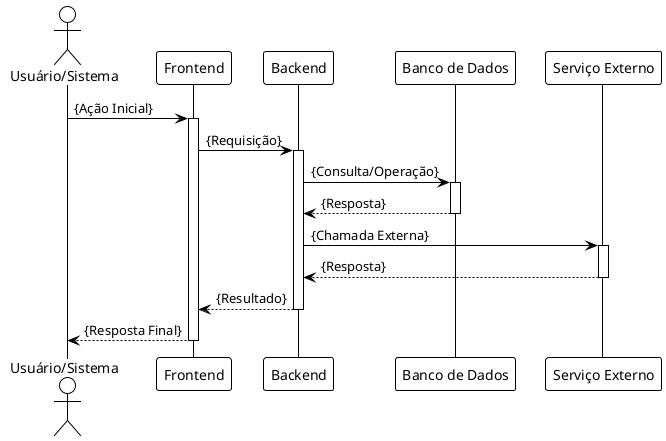

# Template - Enabler Story

## Identificação
- **ID**: EN-{NUMBER}
- **Título**: {TÍTULO DESCRITIVO}
- **Epic**: {NOME DA EPIC}
- **Sprint**: {NÚMERO DA SPRINT}
- **Pontos**: {STORY POINTS}

## Enabler Story

**Como** {PAPEL TÉCNICO/STAKEHOLDER}  
**Eu preciso** {CAPACIDADE/INFRAESTRUTURA/ARQUITETURA}  
**Para que** {BENEFÍCIO TÉCNICO/HABILITAÇÃO}

## Contexto Técnico

{Explicação detalhada do contexto técnico, problema arquitetural ou necessidade de infraestrutura}

## Especificação Técnica

### Objetivo
{Descrição clara do que será implementado/configurado}

### Escopo
- **Incluído**: {O que está dentro do escopo}
- **Excluído**: {O que não está incluído}

### Arquitetura/Design

#### Componentes Envolvidos
- {COMPONENTE 1}: {DESCRIÇÃO}
- {COMPONENTE 2}: {DESCRIÇÃO}
- {COMPONENTE 3}: {DESCRIÇÃO}

#### Diagrama de Sequência



#### Fluxo de Dados
1. {PASSO 1}: {DESCRIÇÃO}
2. {PASSO 2}: {DESCRIÇÃO}
3. {PASSO 3}: {DESCRIÇÃO}

### Especificações Técnicas

#### APIs/Endpoints
```http
{MÉTODO} {ENDPOINT}
Content-Type: application/json

{
  "exemplo": "payload"
}
```

#### Schemas de Dados
```json
{
  "schema": {
    "campo1": "tipo",
    "campo2": "tipo",
    "campo3": {
      "subcampo": "tipo"
    }
  }
}
```

#### Configurações
```yaml
# Exemplo de configuração
configuracao:
  parametro1: valor
  parametro2: valor
```

## Critérios de Aceite Técnicos

### Funcionalidade
**Dado que** {CONTEXTO TÉCNICO}  
**Quando** {AÇÃO/CONFIGURAÇÃO}  
**Então** {RESULTADO TÉCNICO ESPERADO}

### Performance
**Dado que** {CARGA/VOLUME}  
**Quando** {OPERAÇÃO EXECUTADA}  
**Então** {MÉTRICA DE PERFORMANCE ATENDIDA}

### Segurança
**Dado que** {CENÁRIO DE SEGURANÇA}  
**Quando** {TENTATIVA DE ACESSO/OPERAÇÃO}  
**Então** {COMPORTAMENTO DE SEGURANÇA ESPERADO}

### Monitoramento
**Dado que** {SISTEMA EM OPERAÇÃO}  
**Quando** {EVENTO/ERRO OCORRE}  
**Então** {LOG/MÉTRICA REGISTRADA CORRETAMENTE}

## Dependências

### Infraestrutura
- [ ] {RECURSO DE INFRAESTRUTURA}
- [ ] {CONFIGURAÇÃO DE AMBIENTE}

### Técnicas
- [ ] {BIBLIOTECA/FRAMEWORK}
- [ ] {SERVIÇO/API EXTERNA}

### Outras Enablers
- [ ] {ENABLER DEPENDENTE}

## Tasks de Implementação

### Desenvolvimento
- [ ] {TASK DE CÓDIGO}
- [ ] {TASK DE CONFIGURAÇÃO}
- [ ] {TASK DE INTEGRAÇÃO}

### Infraestrutura
- [ ] {TASK DE DEPLOY}
- [ ] {TASK DE MONITORAMENTO}
- [ ] {TASK DE SEGURANÇA}

### Documentação
- [ ] {DOCUMENTAÇÃO TÉCNICA}
- [ ] {DOCUMENTAÇÃO DE API}

## Testes Técnicos

### Testes Unitários
- [ ] {COMPONENTE/FUNÇÃO A TESTAR}

### Testes de Integração
- [ ] {INTEGRAÇÃO A TESTAR}

### Testes de Performance
- [ ] {CENÁRIO DE CARGA}

### Testes de Segurança
- [ ] {TESTE DE VULNERABILIDADE}

## Riscos e Mitigações

| Risco | Probabilidade | Impacto | Mitigação |
|-------|---------------|---------|-----------|
| {RISCO 1} | {ALTA/MÉDIA/BAIXA} | {ALTO/MÉDIO/BAIXO} | {AÇÃO DE MITIGAÇÃO} |
| {RISCO 2} | {ALTA/MÉDIA/BAIXA} | {ALTO/MÉDIO/BAIXO} | {AÇÃO DE MITIGAÇÃO} |

## Métricas de Sucesso

- **Performance**: {MÉTRICA E VALOR ESPERADO}
- **Disponibilidade**: {MÉTRICA E VALOR ESPERADO}
- **Segurança**: {MÉTRICA E VALOR ESPERADO}
- **Qualidade**: {MÉTRICA E VALOR ESPERADO}

## Definition of Ready (DoR)

- [ ] Especificação técnica completa
- [ ] Diagramas de arquitetura/sequência criados
- [ ] Dependências identificadas e validadas
- [ ] Critérios de aceite técnicos definidos
- [ ] Riscos mapeados e mitigações planejadas
- [ ] Pontuação estimada
- [ ] Aprovação técnica do Tech Lead/Arquiteto

## Definition of Done (DoD)

- [ ] Implementação completa conforme especificação
- [ ] Testes técnicos criados e passando
- [ ] Código revisado e aprovado
- [ ] Documentação técnica atualizada
- [ ] Deploy realizado em ambiente de teste
- [ ] Métricas de monitoramento implementadas
- [ ] Testes de performance executados
- [ ] Testes de segurança executados
- [ ] Aprovação técnica final
- [ ] Handover para equipe de operações (se aplicável)

---

**Criado em**: {DATA}  
**Criado por**: {NOME}  
**Última atualização**: {DATA}